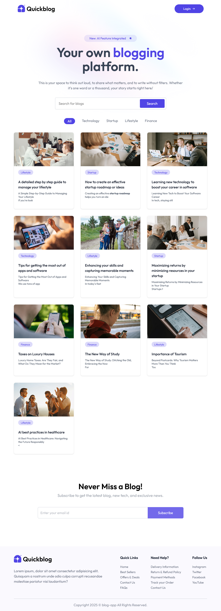
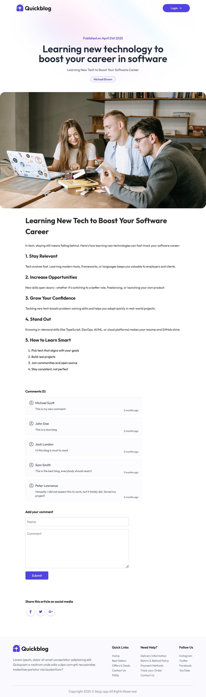

## 🎯 Project Overview

blog-app is a full-stack blog platform built with **React** and **Vite**, featuring AI-powered content suggestions via the **Google Gemini API**. Users can create, edit, and manage blog posts with secure authentication, image uploads, and fast rendering.

## 💡 Key Features

- 📝 Create, edit, and delete blog posts
- 🤖 AI-assisted content generation using Google Gemini
- 🔐 User authentication with JWT tokens
- 🖼️ Upload and deliver optimized images with Multer & ImageKit
- 🎨 Fully responsive UI built with Tailwind CSS
- ⚡ Built with Vite for fast development and bundling

## 🛠️ Technologies Used

- **React 18** — UI Library
- **Vite** — Modern frontend tooling and build system
- **Google Gemini API** — AI-powered content enhancement
- **Express.js** — Backend server and API
- **MongoDB** — NoSQL database for storing posts and users
- **Multer** — Image upload middleware
- **ImageKit** — Optimized image hosting and CDN
- **JWT (jsonwebtoken)** — Authentication and route protection
- **Tailwind CSS** — Utility-first CSS framework
- **Render.com** — Full-stack deployment platform

## 📸 Screenshots

